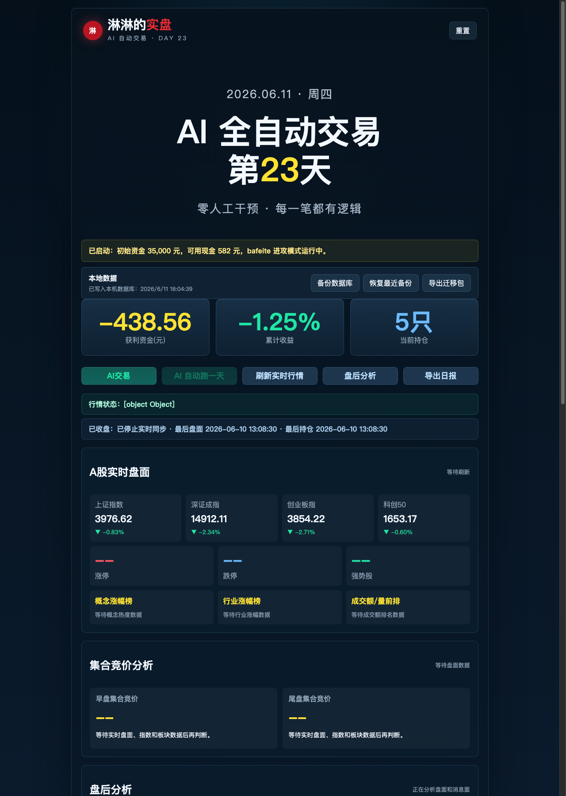

# Linlin Trading Platform

淋淋的 A 股本地交易记录与分析平台，支持本地数据存储、Docker 部署、行情刷新、AI 交易分析和日报导出。

## 效果图



## 本地运行

```bash
python3 server.py
```

浏览器打开：

```text
http://127.0.0.1:5174/
```

## Docker 部署

详细步骤见 [DOCKER部署指南.md](DOCKER部署指南.md)。

## 数据说明

本仓库默认不提交本地交易数据库、备份、日志和导出包。迁移数据请使用网站内的备份/恢复功能，或参考 [README-迁移说明.md](README-迁移说明.md)。
